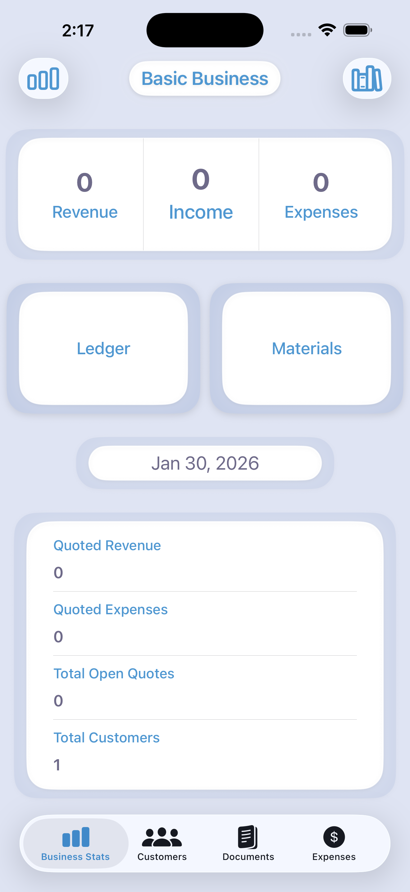
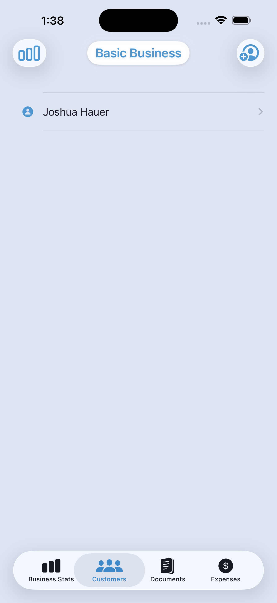
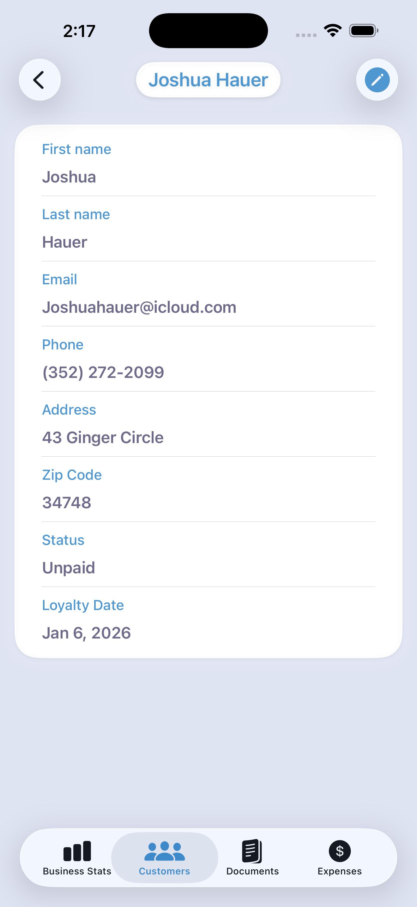
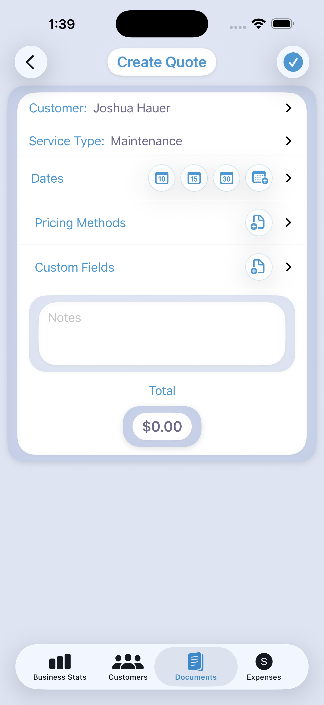
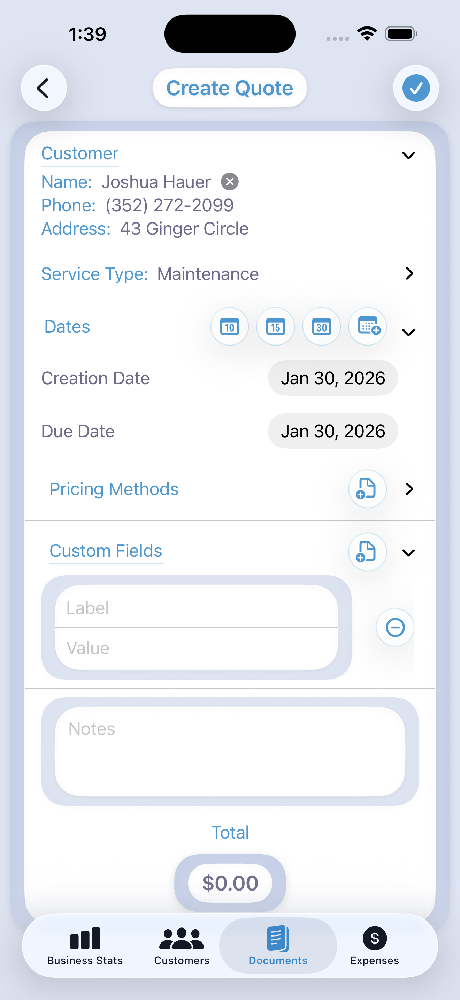
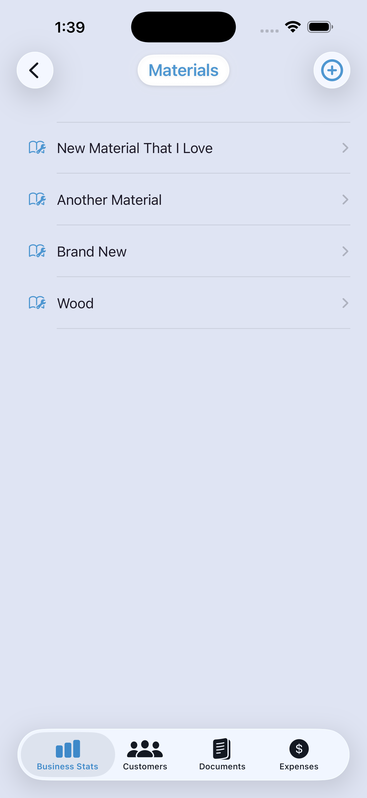

# BasicBusiness

> A production-minded, local-first iOS application demonstrating modular SwiftUI architecture, explicit source-of-truth data flow, and file-based JSON persistence without SwiftData.  
> Designed around real small-business workflows with a strong emphasis on maintainability, correctness, and long-term scalability.

BasicBusiness is a modular SwiftUI iOS application built from real small-business workflows. It is not a SaaS product or a generic “business app” template — it is an opinionated, local-first toolkit focused on maintainable code, clear source-of-truth architecture, and feature-based modularity.

This project is intentionally structured as a long-term portfolio demonstration of real engineering discipline: domain modeling, explicit persistence, architectural tradeoffs, and scalability planning.

---
## Screenshots

### Dashboard / Business Stats
<p align="center">
  
</p>

### Customers
<p align="center">
  
</p>

### Customer Detail
<p align="center">
  
</p>

### Create Quote
<p align="center">
  
</p>

### Quote Detail
<p align="center">
  
</p>

### Materials
<p align="center">
  
</p>
---

## Engineering Highlights

- Explicit bootstrap phase restoring domain models before UI activation.
- Model-owned persistence using `Codable` + `async/await`.
- Local-first architecture — fully functional offline.
- Feature-scoped modules with clear domain boundaries.
- Derived state preferred over stored duplication.
- Explicit save/load flows instead of hidden global state.
- Architecture designed for controlled evolution and migration.

---

## Core Features

### BusinessStats
Implemented:
- Insight hub for application navigation.
- Summary “stat bubbles” linking to underlying entities.
- Journal view organizing activity by month (paid invoices, rollovers, quotes, expenses).

Planned:
- PDF/CSV export.
- Advanced filtering and scheduled reporting.

---

### Customers
Implemented:
- Core system entity.
- Create, edit, and search customers.
- Customer-linked document and activity history.

Planned:
- CSV import/export.
- Optional iCloud sync.

---

### Documents (Quotes & Invoices)
Implemented:
- Quotes convert into invoices.
- Optional material → expense conversion during invoice creation.
- Strong ownership linkage to customers.

Planned:
- Lifecycle states (draft, sent, paid).
- Template customization.
- Optional payment integrations.

---

### Materials
Implemented:
- Reusable catalog for cost and pricing logic.
- Supplies pricing data to quotes and invoices.

Important:
- Materials intentionally do NOT track inventory quantity.

Planned:
- Bulk linking improvements and presets.

---

### Inventory
Implemented:
- Domain scaffolding exists.

Planned:
- Optional quantity tracking module.
- Dedicated rental inventory model (separate domain boundary).

---

### PricingMethod
Implemented:
- Fixed, markup, margin, and cost-plus pricing strategies.
- Reproducible price breakdown calculations.

Planned:
- Customer-specific pricing rules.
- Advanced formula composition.

---

### Shared
Implemented:
- Centralized UI primitives in `AppTheme.swift`.
- Shared formatters and reusable components.

Planned:
- Accessibility audits.
- Expanded component documentation.

---

### User
Implemented:
- Local-first settings model.
- Optional biometric/passcode lock.

Planned:
- Optional multi-device sync.

---

## Architecture & Philosophy

BasicBusiness follows a SwiftUI + MVVM-style structure with strong domain ownership rules.

Design principles:

- Views are declarative and intentionally simple.
- Business logic lives in ViewModels and domain services.
- Domain models are authoritative and own their own persistence.
- Async bootstrap restores the source of truth before UI interaction.
- No implicit global state.
- Explicit save/load flows preferred over hidden side effects.

### Why Not SwiftData?

SwiftData was intentionally avoided in favor of `Codable` + JSON file persistence to:

- Maintain transparent, human-readable data.
- Control migrations explicitly.
- Test save/load flows independently.
- Preserve offline reliability.
- Avoid hidden framework behavior.

The architecture favors control and clarity over convenience abstractions.

---

## Data & Persistence

Storage:
- Local JSON files in Application Support.
- Domain models conform to `Codable`.
- Async save/load APIs per model.

Bootstrap:
- Centralized launch restoration sequence.
- Ensures consistent reconstruction of app state.

Backups:
- Manual JSON export (in development).
- Cloud sync planned as optional extension.

Migrations:
- Explicit model versioning.
- Migration helpers planned for safe schema evolution.

---

## Tech Stack

- Swift
- SwiftUI
- MVVM-style architecture
- Codable JSON persistence
- Async/Await
- SwiftFormat

Recommended: Recent stable Xcode release.

---

## Getting Started

Clone:
```bash
git clone https://github.com/PocketMaru/BasicBusinessIOS.git
cd BasicBusinessIOS
```

Open in Xcode:
```bash
open BasicBusiness.xcodeproj
```

Build:
- Cmd + B  
- Cmd + R  

---

## Project Structure

```
BasicBusiness-iOS/
 ├── BasicBusinessApp.swift
 ├── AppTheme.swift
 ├── MainTabView.swift
 ├── Features/
 │   ├── BusinessStats/
 │   ├── Customers/
 │   ├── Documents/
 │   ├── Domain/
 │   ├── Expenses/
 │   ├── Inventory/
 │   ├── Materials/
 │   ├── PricingMethod/
 │   ├── Shared/
 │   └── User/
 └── Testing/
```

Feature modules are scoped intentionally for long-term scalability.

---

## Code Style

- SwiftFormat configured in `.swiftformat`.
- Views remain thin and declarative.
- Side effects isolated to ViewModels and services.
- Domain types small and testable.

Format locally:
```bash
brew install swiftformat
swiftformat .
```

---

## Testing

- Unit tests focus on domain logic, pricing, and persistence.
- Run with Cmd + U in Xcode.

---

## Roadmap

Short Term:
- PDF/CSV export.
- Improved quote lifecycle.
- Backup/restore UX.

Medium Term:
- Optional cloud sync.
- Optional inventory quantity module.
- Migration versioning system.

Long Term:
- Payment adapters.
- Multi-user support.
- Server-backed sync as optional extension.

---

## Maintainer

PocketMaru  
https://github.com/PocketMaru
